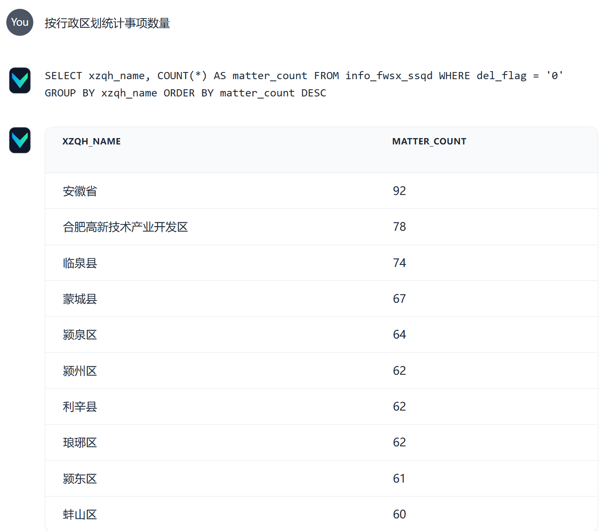
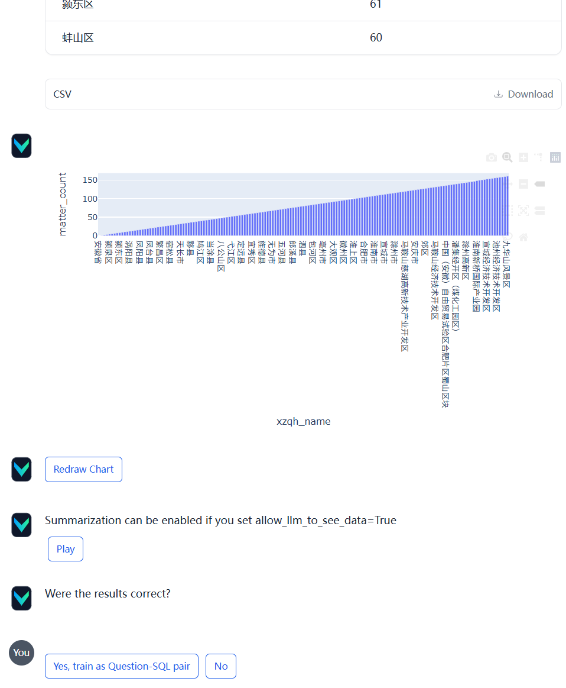
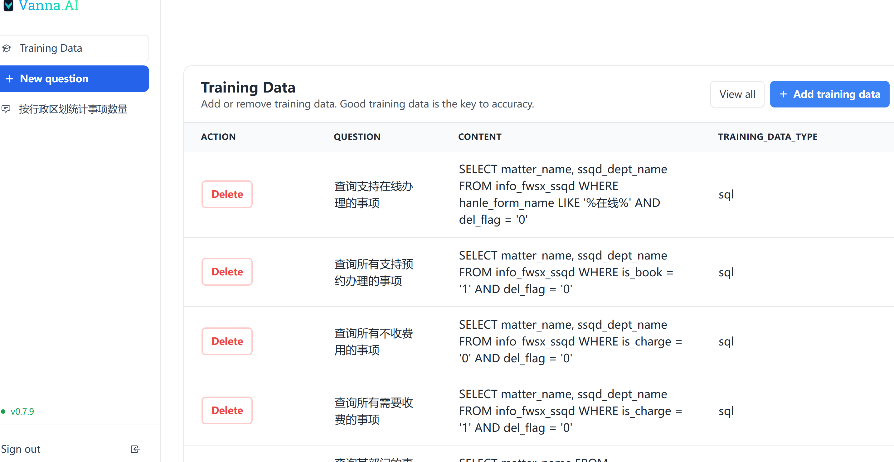
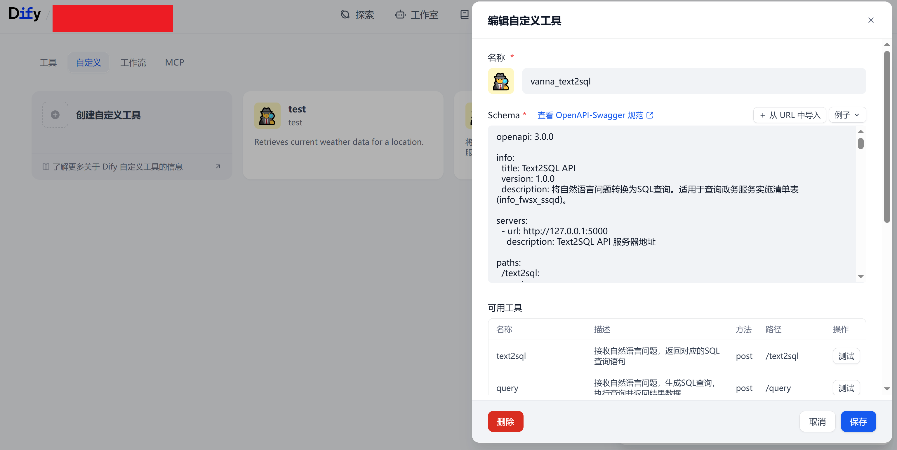
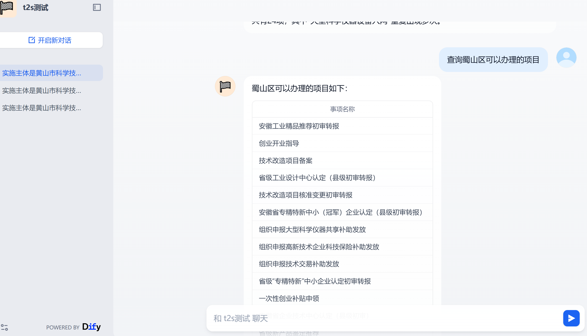

# Vanna Text-to-SQL V2

基于 Vanna 框架的自然语言转 SQL 查询系统，支持多种 LLM 后端，提供 Web UI 和 API 两种服务模式。

## 基本功能

### 核心功能
- **自然语言转 SQL**：将用户提出的自然语言问题自动转换为 SQL 查询语句
- **SQL 执行与结果返回**：支持直接执行生成的 SQL 并返回查询结果
- **多 LLM 后端支持**：支持 Ollama、OpenAI API、vLLM 三种 LLM 后端
- **训练数据管理**：支持通过 DDL、文档说明和 SQL 示例进行模型训练
- **持久化存储**：使用 ChromaDB 存储向量数据，支持持久化

### 服务模式
1. **Vanna Web UI**：提供交互式的 Web 界面，支持可视化查询和 SQL 生成
2. **API 服务器**：提供 RESTful API 接口，供 Dify 等外部系统调用

### 效果示例
### 1.vanna
#### 1.1. 文本转 SQL

#### 1.2. 统计结果绘图

### 1.3. 训练数据管理

### 2. 接入dify
#### 2.1 工具定义

#### 2.2 运行结果

## 项目架构

### 架构设计
项目采用分层架构和依赖注入模式，主要包含以下模块：

```
vanna_text2sql_v2/
├── apps/              # 应用层
│   ├── vanna_app.py   # Vanna Web UI 应用
│   └── api_app.py     # API 服务器应用
├── api/               # API 层
│   ├── routes.py      # Flask 路由定义
│   └── handlers.py    # API 请求处理器
├── core/              # 核心业务逻辑层
│   ├── llm/           # LLM 后端实现
│   │   ├── base.py    # LLM 后端基类
│   │   ├── ollama.py  # Ollama 后端
│   │   ├── openai.py  # OpenAI 后端
│   │   └── vllm.py    # vLLM 后端
│   └── vanna/         # Vanna 相关
│       ├── factory.py # Vanna 实例工厂
│       └── trainer.py # 训练器
├── config/            # 配置层
│   └── loader.py      # 配置加载器
├── training_data/     # 训练数据
│   ├── ddl.sql        # 数据库 DDL
│   ├── documents.md   # 文档说明
│   └── sql_examples.json  # SQL 示例
├── dependencies.py    # 依赖注入容器
├── main.py            # 应用入口
└── config.yaml        # 配置文件
```

### 设计模式
- **依赖注入（DI）**：通过 `DependencyContainer` 统一管理组件依赖
- **工厂模式**：`VannaFactory` 负责创建 Vanna 实例
- **策略模式**：不同 LLM 后端实现统一的接口

## 启动方式

### 环境要求
- Python 3.8+
- 已安装项目依赖（见 `requirements.txt`）

### 安装依赖
```bash
pip install -r requirements.txt
```

### 启动应用

#### 1. 启动 API 服务器（默认模式）
```bash
# 使用自定义配置文件
python main.py --config custom_config.yaml

# 使用默认配置
python main.py

# 或显式指定
python main.py api


```

#### 2. 启动 Vanna Web UI
```bash
python main.py vanna

# 使用自定义配置文件
python main.py vanna --config custom_config.yaml
```

#### 3. 命令行参数
```bash
python main.py [vanna|api] [选项]

选项:
  --config PATH   配置文件路径（默认: config.yaml）
  --host HOST     服务器主机地址（覆盖配置文件）
  --port PORT     服务器端口号（覆盖配置文件）
  --debug         开启调试模式（覆盖配置文件）
```

### 启动示例
```bash
# 启动 API 服务器，监听 8080 端口
python main.py api --port 8080

# 启动 Vanna Web UI，使用调试模式
python main.py vanna --debug

# 使用自定义配置文件启动
python main.py --config production.yaml --host 0.0.0.0 --port 5000
```

## 配置文件

### 配置文件位置
主配置文件为 `config.yaml`，项目提供了 `config.yaml.example` 作为配置模板。

### 配置步骤
1. 复制配置模板：
   ```bash
   cp config.yaml.example config.yaml
   ```

2. 编辑 `config.yaml`，配置以下内容：

### 配置项说明

#### LLM 模型配置
```yaml
# LLM 类型：ollama, openai, vllm
llm_type: "vllm"
```

#### Ollama 配置（当 llm_type=ollama 时）
```yaml
ollama:
  model: "qwen3:32b"                    # Ollama 模型名称
  ollama_host: "http://localhost:11434" # Ollama 服务地址
  allow_llm_to_see_data: true           # 是否允许 LLM 查看数据
```

#### OpenAI/vLLM 配置（当 llm_type=openai 或 vllm 时）
```yaml
openai:
  api_key: "EMPTY"                      # API Key（vLLM 通常设为 "EMPTY"）
  api_base: "http://localhost:8000/v1"  # OpenAI 兼容 API 地址
  model: "qwen3-30b-instruct"          # 模型名称
  allow_llm_to_see_data: true           # 是否允许 LLM 查看数据
```

#### 数据库配置
```yaml
database:
  host: "localhost"                     # 数据库主机地址
  port: 3306                            # 数据库端口
  dbname: "your_database"               # 数据库名称
  user: "root"                          # 数据库用户名
  password: "your_password"             # 数据库密码
```

#### Flask 应用配置
```yaml
flask:
  host: "0.0.0.0"                       # 监听地址（0.0.0.0 表示所有接口）
  port: 5000                            # 监听端口
  debug: false                          # 调试模式（生产环境建议设为 false）
```

#### 训练数据路径配置
```yaml
training:
  ddl_path: "training_data/ddl.sql"                    # DDL 文件路径
  documents_path: "training_data/documents.md"         # 文档说明路径
  sql_examples_path: "training_data/sql_examples.json" # SQL 示例路径
```

#### ChromaDB 持久化配置（可选）
```yaml
# ChromaDB 持久化存储路径（可选）
# 如果不配置，默认使用 data/chroma/ 目录
chroma_db_path: "data/chroma"
```

### 完整配置示例
```yaml
# Vanna Text-to-SQL 配置文件

llm_type: "vllm"

openai:
  api_key: "EMPTY"
  api_base: "http://ip:port/v1"
  model: "qwen3-30b-instruct"
  allow_llm_to_see_data: true

database:
  host: "yourhost"
  port: 12881
  dbname: "dbname"
  user: "root"
  password: "123456"

flask:
  host: "0.0.0.0"
  port: 5000
  debug: false

training:
  ddl_path: "training_data/ddl.sql"
  documents_path: "training_data/documents.md"
  sql_examples_path: "training_data/sql_examples.json"

chroma_db_path: "data/chroma"
```

## API 接口

### 1. 文本转 SQL
**接口**: `POST /text2sql`

**请求体**:
```json
{
  "question": "查询所有事项名称"
}
```

**响应**:
```json
{
  "sql": "SELECT matter_name FROM info_fwsx_ssqd WHERE del_flag = '0'",
  "question": "查询所有事项名称",
  "status": "success"
}
```

### 2. 执行查询（返回结果）
**接口**: `POST /query`

**请求体**:
```json
{
  "question": "查询所有事项名称"
}
```

**响应**:
```json
{
  "sql": "SELECT matter_name FROM info_fwsx_ssqd WHERE del_flag = '0'",
  "question": "查询所有事项名称",
  "data": [
    {"matter_name": "事项1"},
    {"matter_name": "事项2"}
  ],
  "row_count": 2,
  "columns": ["matter_name"],
  "status": "success"
}
```

### 3. 健康检查
**接口**: `GET /health`

**响应**:
```json
{
  "status": "healthy",
  "service": "text2sql-api"
}
```

### 4. OpenAPI 规范
- `GET /openapi.yaml` - 获取 OpenAPI 规范（YAML 格式）
- `GET /openapi.json` - 获取 OpenAPI 规范（JSON 格式）
- 也可以直接查看[openapi.yaml](openapi.yaml)

## 训练数据

项目支持三种类型的训练数据：

1. **DDL（数据定义语言）**：`training_data/ddl.sql`
   - 包含数据库表结构定义
   - 帮助模型理解数据库 schema

2. **文档说明**：`training_data/documents.md`
   - 包含业务逻辑和字段说明
   - 帮助模型理解业务含义

3. **SQL 示例**：`training_data/sql_examples.json`
   - 包含问题-SQL 对示例
   - 格式：`[{"question": "问题", "sql": "SQL语句"}, ...]`
   - 提供相似问题匹配的参考

## 使用示例

### 使用 curl 调用 API
```bash
# 文本转 SQL
curl -X POST http://localhost:5000/text2sql \
  -H "Content-Type: application/json" \
  -d '{"question": "查询所有事项名称"}'

# 执行查询
curl -X POST http://localhost:5000/query \
  -H "Content-Type: application/json" \
  -d '{"question": "查询所有事项名称"}'
```

### 使用 Python 调用
```python
import requests

# 文本转 SQL
response = requests.post(
    "http://localhost:5000/text2sql",
    json={"question": "查询所有事项名称"}
)
result = response.json()
print(result["sql"])

# 执行查询
response = requests.post(
    "http://localhost:5000/query",
    json={"question": "查询所有事项名称"}
)
result = response.json()
print(result["data"])
```

## 注意事项

1. **首次运行**：首次启动时会自动进行训练，可能需要一些时间
2. **数据库连接**：确保数据库配置正确且数据库服务可访问
3. **LLM 服务**：确保对应的 LLM 服务（Ollama/OpenAI/vLLM）已启动并可访问
4. **训练数据**：建议准备充足的训练数据以提高 SQL 生成质量
5. **ChromaDB 存储**：向量数据会持久化到指定目录，首次运行后会创建

## 项目结构说明

- `apps/`: 应用入口，包含两种应用模式的实现
- `api/`: API 路由和处理器
- `core/`: 核心业务逻辑，包括 LLM 后端和 Vanna 封装
- `config/`: 配置管理模块
- `training_data/`: 训练数据存放目录
- `data/`: 数据存储目录（ChromaDB 等）
- `dependencies.py`: 依赖注入容器
- `main.py`: 应用主入口

## 许可证

本项目基于 Vanna和 Dify 框架开发，请遵循相应的开源许可证。

